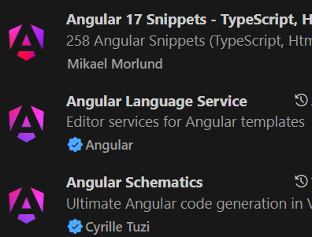

# TypeScript簡介
    1. 是JavaScript的超集合，需透過Transpile轉換成js語法，轉換成js後就不再有ts的型別約束
    2. 撰寫時可以指定變數、參數的型別，如此在「開發ts時期」呼叫function可以更明確知道參數與回傳內容
    3. 如同Java的開發體驗，擁有類別、介面、繼承、裝飾器等特性
## 安裝
    1. 安裝NodeJS
        javascript要在本地端執行，需要NodeJS環境，也可以透過NodeJS的npm指令下載套件。
    2. 用npm安裝typescript
        > npm install -g typescript
    3. VS code
        以 VS code 撰寫TypeScript可以得到語法提示，開發順暢
    4. VS code下載Extensions方便開發
    5. 創建一個檔案，副檔名給.ts，如basic.ts
    6. 將.ts檔Transpile成js，執行後會生成一份js檔
```
tsc .\basic.ts
``` 
 
   
## 基本型別
### 宣告語法
```Typescript
//let 變數名稱 : 型別 = 值
let str: string = 'test string';
let decimal: number = 12.345;
let isExist: boolean = true;
let data: any = 123; //任意
```
### 陣列
可以限制陣列內容
```Typescript
let onlyNumber: number[] = [1, 2, 3];
let onlyNumber2: Array<number> = [1, 2, 3];
let numberOrStr: Array<number | string> = ['1', 2];
//元組Tuple: 限定長度3, 限定各位置型別
let tuple: [boolean, number, number] = [true, 1, 3];
```

### enum
列舉，用於自訂 字串對應數字
```Typescript
enum Color {RED, BLUE, GREEN};
console.log(Color.RED); //0
console.log(Color[0]); //RED
// GREEN=4
enum Color {RED, BLUE=3, GREEN};
console.log(Color.GRREN); //4

// RED消失，被GREEN覆蓋
enum Color {RED=1, BLUE=0, GREEN};
console.log(Color[1]); //GREEN
```

### Function宣告
會檢查function名稱，不可重複
```Typescript
//function 名稱(參數:參數型別):回傳型別
function myAdd(num1: number, num2: number): number {
    return num1 + num2;
}
//另一種宣告方式
let myPrtin = function(content: string): void {
    console.log(content);
}
```

因為明確定義參數，因此使用上如果需要彈性，則可宣告optional變數，
optional必須在後方
```Typescript
//名稱後 + ?; 用= 可給預設值，有預設值則可以傳undefined當參數
function buildName(firstName: string = 'defaultName', lastName?: string): string {
    if (lastName) {
        firstName += lastName;
    }
    return firstName;
}
```

